# Entry 1: Settling On My Tool & Project Idea For The Year-Long Freedom-Project
##### 11/3/2025

## Content: Why did I Choose Flutter For My Freedom-Project?

### MAIN Freedom Project Idea

In the beginning, I had trouble thinking of my MAIN project idea for my freedom project. So on September 14, I had a great inspiration that hit me!

It was supposed to be a normal Sunday weekend, but my mom dragged me to the doctor's appointment for a flu shot. So yea, I was pretty upset. I was on my way home, talking to my friends on Discord and listening to music. So, then, it suddenly hit me!

How about I create a project about depression, making people less depressed!

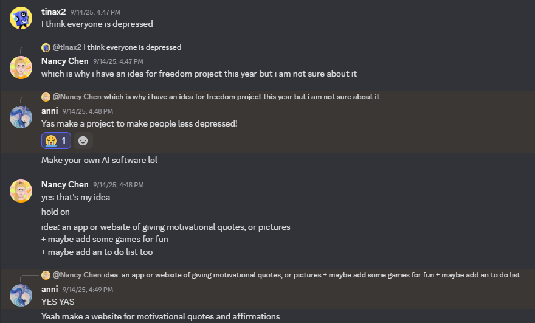

My MAIN project idea is an app called CheerCharm.

It will have 3 functions. It can give the user motivation quotes/advice. The user can make a "to do list" for organization. If bored, the user can play some games in the "games" section. The purpose is to make a project to make people less depressed!

The tool I chose is Flutter.

### BACKUP Freedom Project Idea

In the beginning, I had trouble thinking of my BACKUP project idea for my freedom project, too. So on September 24, I was talking to my friends on Discord, and I had an another great inspiration that hit me!

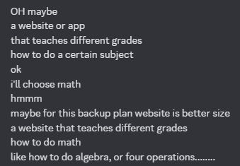

My BACKUP project idea is a website that teaches different grades how to do certain topics/skills of math (like how to do algebra or area or volume...).

The purpose is to make a project to make students understand math!

The tool I chose is React.

Since I choose Flutter, I tinkered with it 2 times so far.

This is my notes on tinkering with Flutter:

#### 10/5/2025:

Link: [Flutter Crash Course #1 - What is Flutter?](https://youtu.be/j_rCDc_X-k8?si=7SZVABDTw0zlmIqr)

Notes:

What is Flutter?
* a framework for creating cross-platform applications

It's for Android, iOS, Desktop, and Web.

It's written using the Dart programming language & takes advantage of Material Design features.

It has similar layout principles to CSS.

This is a website, which is the official package repository for darts & flutter: [A website for packages](pub.dev)

Flutter website: [Flutter codes & examples](https://docs.flutter.dev/)

Link: [Flutter Crash Course #2 - Installing on Windows](https://youtu.be/DvZuJeTHWaw?si=OveUKH7cdz3vChn_)

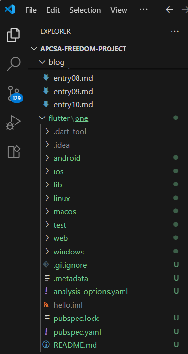

My Install Flutter Progress:


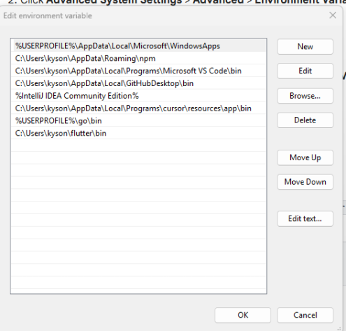

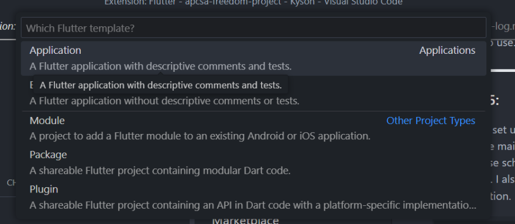

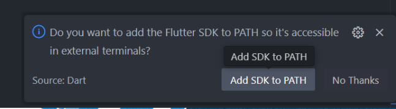

My link to code tinker: [Click the link](https://github.com/nancyc0337/apcsa-freedom-project/tree/main/flutter/one)

#### 10/27/2025 & 11/2/2025:

Link: [Flutter Crash Course #4 - Making a New Flutter Project](https://youtu.be/adNHZVBd284?si=CT8Yu91mnqcQ_Z4Q)

Notes:

To make up a brand new flutter project:
* navigate to the directory that you want to create the project in

! try not to have any directory with any spaces or special characters.

use _ if need to use space

`flutter create name` = creates the project

`flutter run` = runs the project

Click mobile emulator, Start the name of the emulator, it'll show an iphone, will demonstrate how our code will show on our phone.

Since I didn't have the emulator, I have to download android studio: https://developer.android.com/studio.

Pictures of downloading the android studio:

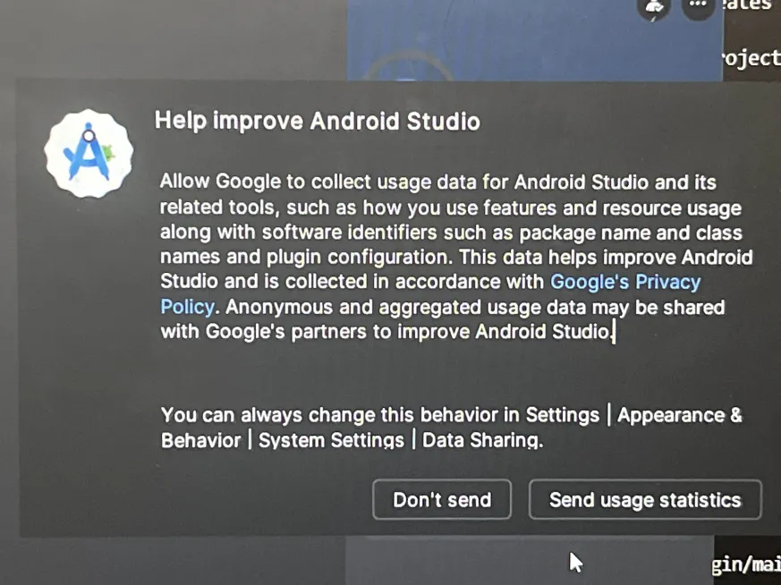

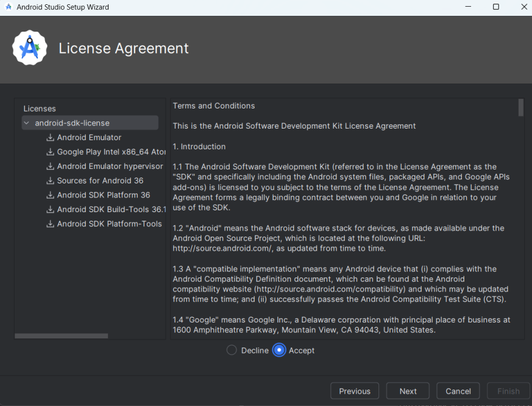


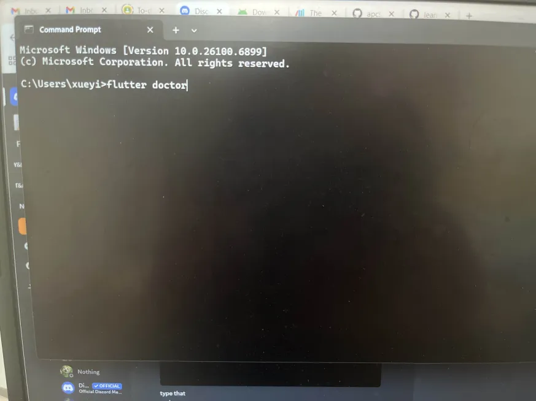

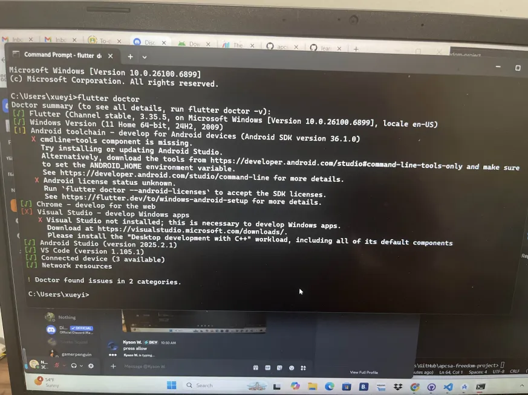


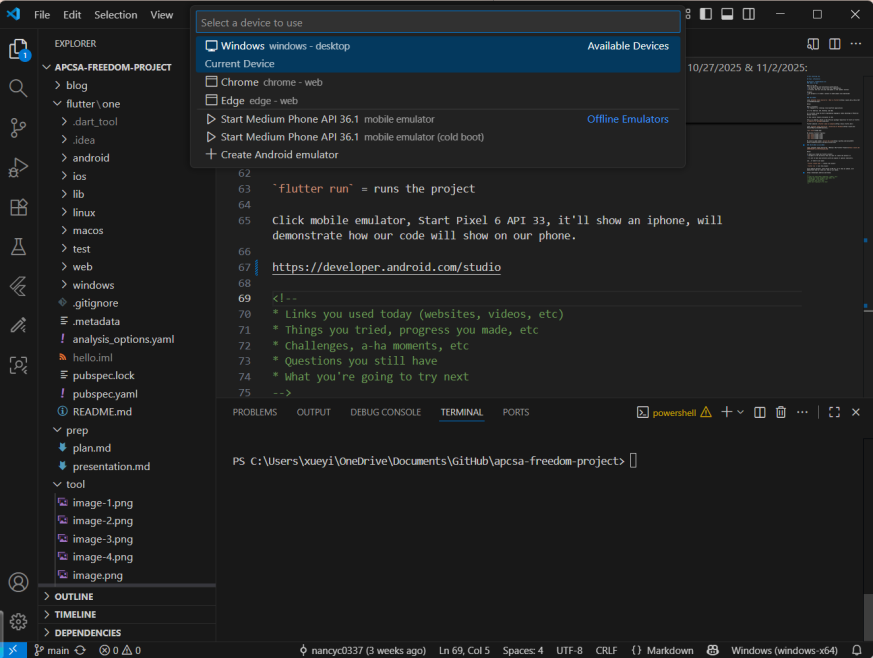


This is where & what my code will show:

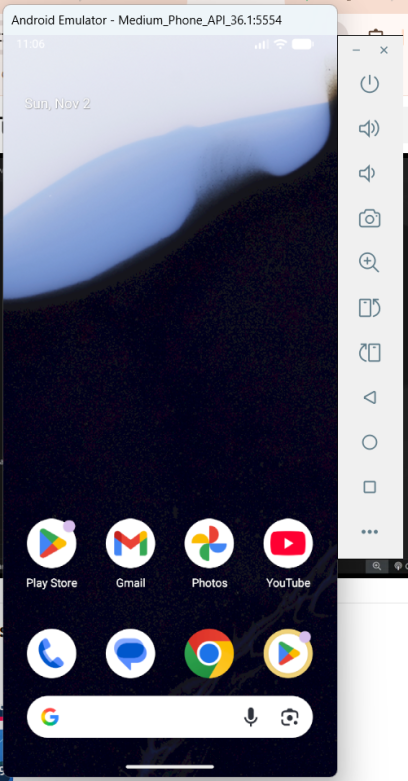

Link: [Flutter Crash Course #5 - Quick Project Overview](https://youtu.be/qdyt8UO-MqM?si=4hUVkXfj3QYbpOh3)

Notes:

* inside the `lib` folder, there should be a `main.dart` file
  * mostly where all my application is going to be
  * where I'm going to do most of my coding

Code #1:

``` flutter
void main() {
  runApp(const MyApp());
}
```
Explanation:
* my Kickstart of my application
* runs automatically
* `runApp` actually runs the application

In `runApp`, there we can have a variable that we can use as a class and use it as an argument (root widget).

Code #2:

``` flutter
@override
  Widget build(BuildContext context) {
    return MaterialApp(
      title: 'Flutter Demo',
      theme: ThemeData(
        colorScheme: ColorScheme.fromSeed(seedColor: Colors.deepPurple),
      ),
      home: const MyHomePage(title: 'Flutter Demo Home Page'),
    );
  }
```
Explanation:
* `Widget build(BuildContext context) {}` = root of my application
* `home: const MyHomePage(title: 'Flutter Demo Home Page'),` = title on my application

* `title: Text(widget.title),` = title

* `body: Center()` = Center is a layout widget. It takes a single child and positions it in the middle of the parent.

* `child: Column()` = Column is also a layout widget. It takes a list of children and arranges them vertically. By default, it sizes itself to fit its children horizontally, and tries to be as tall as its parent.

Link: [Flutter Crash Course #6 - Widgets](https://youtu.be/L0izVqsaxLI?si=4Gnkv4zZsbDYvzpF)

Notes:

What is a widget?
* Widget is actually just a class

* `class MyApp extends StatelessWidget {}`

Explanation:
* stateless means this widget won't contain any state / data which changes over time / in response to something like user clicking on a button...

* if we want to output an image = use an image widget
* if we need a container for a layout = use a container widget
* if we need a column for a layout = use a column widget
* we can also make our own custom widget

...

Widget Tree:

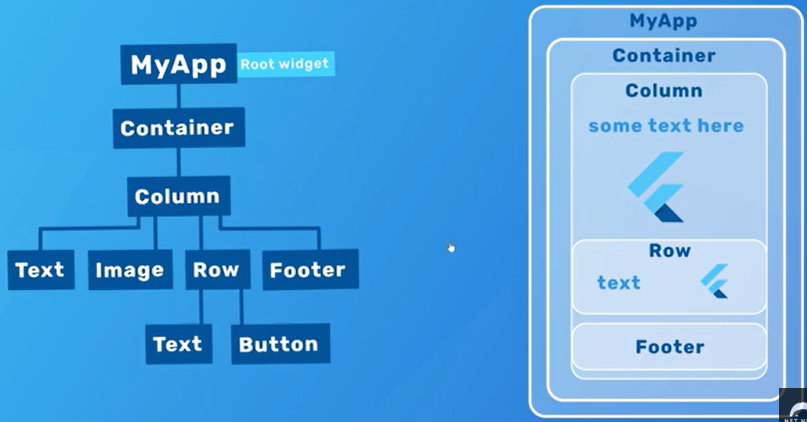

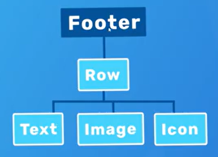

* most widgets will be pre-made or customable

My link to code tinker: [Click the link](https://github.com/nancyc0337/apcsa-freedom-project/tree/main/flutter/one)

## Sources

My first resource is from my IDE/Github, where I stored & tinkered with my tool (tool folder): [Link To My Tool Folder](https://github.com/nancyc0337/apcsa-freedom-project/tree/main/tool).

My second resource is from my IDE/Github, where I wrote down my progress of what I did with my tool: [Link To My Learning Log](https://github.com/nancyc0337/apcsa-freedom-project/blob/main/tool/learning-log.md).

My third resource is a website about Flutter: [Link To flutter.dev](https://flutter.dev/).

My fourth resource is a Flutter Tutorials playlist from Youtube that I found: [Link To The Flutter Crash Course](https://youtube.com/playlist?list=PL4cUxeGkcC9giLVXCHSQmWqlHc9BLXdVx&si=ukFdAKzmSUXAv6PO).

## Engineering Design Process

Right now in the Engineering Design Process(EDP), I am on the 1st(Define the problem), 2nd(Research the problem), 3rd(Brainstorm possible solutions) and 4th step(Plan the most promising solution). Our 1st step was to decide what we would like to make for our Freedom Project. Then we decide on our groups, tool and backup tool. We tinker with the tool and confirm our tool. I think I'll be on 5th step(Create a prototype) to create our game.

## Skills

1) Creativity

The 1st skill I learned during this process is **Creativity**.

On September 14 & 24, I used my creativity to think of my MAIN & BACKUP Freedom Project idea to help my users/people to solve a problem.

For my MAIN Freedom Project idea is an app called CheerCharm.

It will have 3 functions. It can give the user motivation quotes/advice. The user can make a "to do list" for organization. If bored, the user can play some games in the "games" section. The purpose is to make a project to make people less depressed!

The tool I chose is Flutter.

For my BACKUP Freedom Project idea is a website that teaches different grades how to do certain topics/skills of math (like how to do algebra or area or volume...).

The purpose is to make a project to make students understand math!

The tool I chose is React.

2) Collaboration & Debugging

The 2nd & 3rd skill I learned during this process is **Collaboration & Debugging**.

During my tinkering with Flutter, downloading & installing the tool was really difficult.

So I asked my friend/classmate, Shi Jun for help. Installing Flutter took me like 2 days, 6-8 hours.

## Summary
In conclusion, I'm excited to learn more about Flutter to make my CheerCharm app to help people to be less depressed!

[Next](entry02.md)

[Home](../README.md)
