# Entry 2: Learning My Tool & Make Freedom Project Goal For The Winter Break
##### 12/15/2025

## Content: Learning My Tool & Making My Freedom Project Goal For The Winter Break

From November 10 to December 15, I have been learning my tool **Flutter**. I used [this YouTube Tutorial](https://youtube.com/playlist?list=PL4cUxeGkcC9giLVXCHSQmWqlHc9BLXdVx&si=ukFdAKzmSUXAv6PO). While watching the tutorials, I took notes and tinkered in my IDE.

### My Notes In My Learning Log

#### 11/16/2025: MaterialApp & Scaffold

Link: [Flutter Crash Course #7 - MaterialApp & Scaffold](https://youtu.be/U0vS27vqKSo?si=KNA8m3Xi48GprdTU)

Notes:

`runApp(MaterialApp());`
* prebuilt widget
* acts like a wrapper
* applies Google's material design styles / makes them available to all of the built-in core widgets like buttons, app bars, text...

`import 'package:flutter/material.dart';`
* core package provided by flutter
  * no need to install anything extra

! on top of the **main.dart** file, starter code

* material app widget accepts a bunch of different optional named arguments when we use it

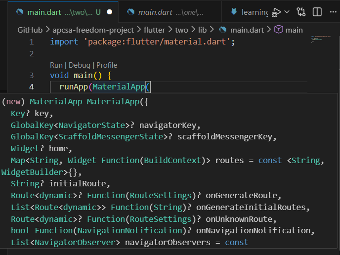

For any widget I hover over: The arguments are white & respective types are in green.

If we hover the argument name, we can see some information about it.


``` flutter
void main() {
  runApp(const MaterialApp(
    home: Text('hello, ninjas'),
  ));
}
```

* `constant` = it knows that the value won't change after compile time
  * therefore if the widget tree ever gets rebuilt anything with a constant in front of it can be reused again rather than rebuilt from scratch
  * flutter knows it's a constant and its value is always going to be the same

* we can optimize performance by making something a constant
* you might also see red error lines when something that was previously a const cannot be one anymore where we might have changed something within that widget in which case we just remove the const keyword


It shows really horrible looking text at the top with a double yellow line underneath it.

My link to code tinker: [Click the link](https://github.com/nancyc0337/apcsa-freedom-project/tree/main/flutter/two)

#### 11/23/2025: MaterialApp & Scaffold

Link: [Flutter Crash Course #7 - MaterialApp & Scaffold](https://youtu.be/U0vS27vqKSo?si=KNA8m3Xi48GprdTU)

Notes:

Link: https://api.flutter.dev/flutter/material/MaterialApp-class.html

Problem: Text widgets that lack a Material ancestor will be rendered with an ugly red/yellow text style.

Solution: The typical fix is to give the widget a Scaffold ancestor. The Scaffold creates a Material widget that defines its default text style.

``` flutter
appBar: AppBar(
  title: const Text('My Coffee Id'),
  backgroundColor: Colors.brown[200],
  centerTitle: true,
),
body: const Text('Hello, ninjas!'),
```
Explanation:
* `title: const Text('My Coffee Id'),` = prints out the text "My Coffee Id"
* `backgroundColor: Colors.brown[200],` = gives out the background color & the value inside [] shows the darkness/lightness of the color
* `centerTitle: true,` = title is in the center of the screen
* `body: const Text('Hello, ninjas!'),` = the text will print in the body

My output of my code:


My link to code tinker: [Click the link](https://github.com/nancyc0337/apcsa-freedom-project/tree/main/flutter/two)

#### 12/7/2025: Stateless Widgets

Link: [Flutter Crash Course #8 - Stateless Widgets](https://youtu.be/tDKgJEvhaP8?si=dBIKE5gKsaySj9_q)

Notes:

To get a new stateless widget:
* type stl & then hitting tab

(stl means stateless)

Then this should pop up:

```flutter
class MyWidget extends StatelessWidget {
  const MyWidget({super.key});

  @override
  Widget build(BuildContext context) {
    return const Placeholder();
  }
}
```

* I should start my class names with a captial letter

`extends StatelessWidget` = it inherits all the functionality that a stateless widget should have in flutter
* stateless means the widget won't contain any state that changes over time or in reaction to maybe an user event

`const MyWidget({super.key});` = constructor for the class
* takes in a single argument called key (defined within the widget class it inherits from)
  * `{super.key}` passes that key to its parent class
  * all widgets in flutter have this optional key argument

``` flutter
@override
Widget build(BuildContext context) {
  return const Placeholder();
}
```
* build function, should return a widget/widget tree

`@override` = override declaration, overriding the inherited version of the function
* the function also exists on the parent class that we extend inside the function
  * inside the override declaration, we automatically get access to a build context object as a parameter

* inside the build method, we'll return a widget/widget tree

To see the change automatically for the stateless widgets, click the "save and hot reload button" (yellow lightning bolt).


The point of using stateless widget:

1) we've now enabled hot reload during development for any changes we make within a build function

2) the home widget can return much more content than just a text widget
* it can return a whole widget tree, with a bunch of widgets within it

Process:

1) Before adding stateless widget

Code:

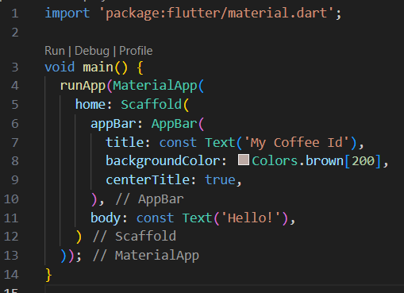

Output:


2) stateless widget with the placeholder

Code:

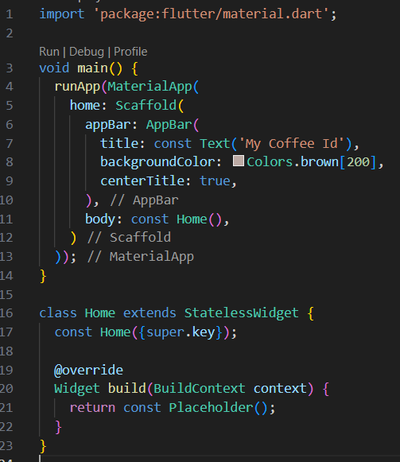

Output:

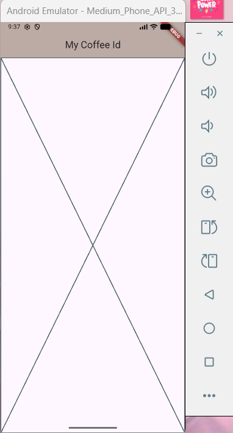

3) stateless widget with text

Code:

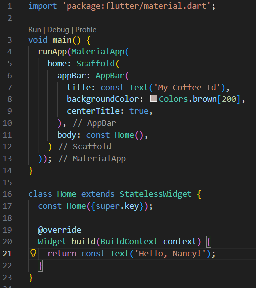

Output:

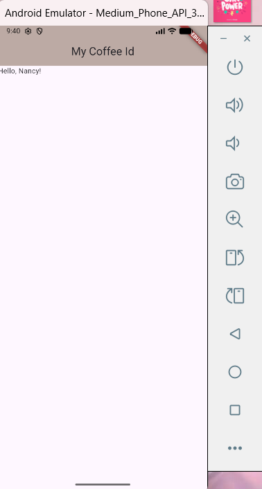

I can use click "save and hot reload button" (yellow lightning bolt), no need to click "restart" (green reload arrow).

Code:


Output:


My link to code tinker: [Click the link](https://github.com/nancyc0337/apcsa-freedom-project/tree/main/flutter/three)

#### 12/14/2025: Containers

Link: [Flutter Crash Course #9 - Containers](https://youtu.be/KgINruWilhc?si=N5KLUR9NqUTMkWkZ)

Notes:

Container widgets
* act as wrappers to other content/other widgets
* flexible

* when the container doesn't have a child, it takes up all of the available space around it by default

Code:


Output:

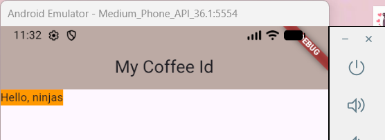

Code:


Output:


Explanation:

* the width & height affects how high & long the container/child is

Code:

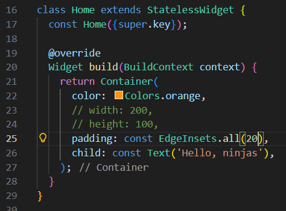

Output:


Explanation:

* `EdgeInsets` is how we will provide padding & margins
* `all` = apply padding/margin to all sides

Code:

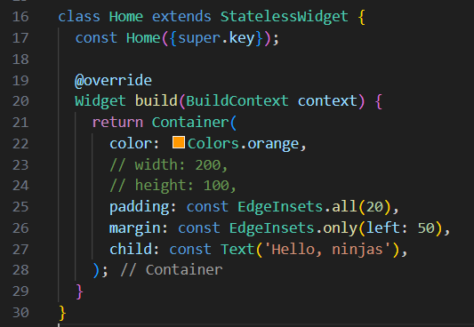

Output:

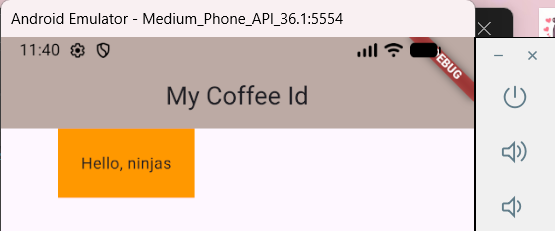

Explanation:

* `EdgeInsets` is how we will provide padding & margins
* `only` = only one side

Code:


Output:


Explanation:

* `EdgeInsets.fromLTRB`
  * `LTRB` stands for **L**eft **T**op **R**ight **B**ottom

Code:

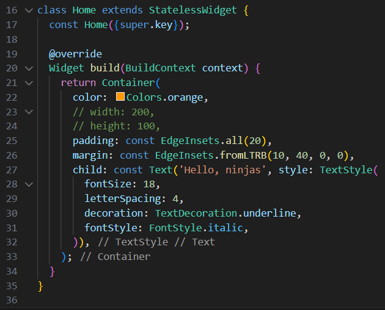

Output:

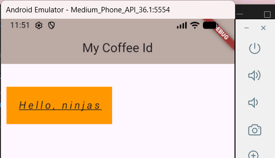

Explanation:

To decorate the text: `style: TextStyle(),`

Font-size: `fontSize #,`

spacing of the letters: `letterSpacing: #,`

how to decorate the style of the text: `decoration: TextDecoration.style,`

how to apply font: `fontStyle: FontStyle.style,`

My link to code tinker: [Click the link](https://github.com/nancyc0337/apcsa-freedom-project/tree/main/flutter/four)

For the winter break (December 24 - January 4), my Freedom Project goal is to continue watching the [YouTube Tutorial](https://youtube.com/playlist?list=PL4cUxeGkcC9giLVXCHSQmWqlHc9BLXdVx&si=ukFdAKzmSUXAv6PO). After finishing the [YouTube Tutorial](https://youtube.com/playlist?list=PL4cUxeGkcC9giLVXCHSQmWqlHc9BLXdVx&si=ukFdAKzmSUXAv6PO), I'll use what I learned about **Flutter** to make my CheerCharm app to help people to be less depressed!

## Sources

My first resource is from my IDE/Github, where I stored & tinkered with my tool (tool folder): [Link To My Tool Folder](https://github.com/nancyc0337/apcsa-freedom-project/tree/main/tool).

My second resource is from my IDE/Github, where I wrote down my progress of what I did with my tool: [Link To My Learning Log](https://github.com/nancyc0337/apcsa-freedom-project/blob/main/tool/learning-log.md).

My third resource is from my IDE/Github, where I tinkered with my tool: [Link To My Tinkering](https://github.com/nancyc0337/apcsa-freedom-project/tree/main/flutter).

My fourth resource is a website about Flutter: [Link To flutter.dev](https://flutter.dev/).

My fifth resource is a Flutter Tutorials playlist from Youtube that I found: [Link To The Flutter Crash Course](https://youtube.com/playlist?list=PL4cUxeGkcC9giLVXCHSQmWqlHc9BLXdVx&si=ukFdAKzmSUXAv6PO).

## Engineering Design Process

Right now in the Engineering Design Process(EDP), I am on the 5th step(Create a prototype). Currently, we are using many resources to learn our tool to make our project. I think I'll be on 6th step(Test and evaluate the prototype), using what we learned about our tool to create our game.

## Skills

1) How to learn & Organization

The 1st & 2nd skill I learned during this process is **How to learn & Organization**.

Throughout this process, I learned all about Flutter myself with the Flutter Tutorials playlist from Youtube that I found: [Link To The Flutter Crash Course](https://youtube.com/playlist?list=PL4cUxeGkcC9giLVXCHSQmWqlHc9BLXdVx&si=ukFdAKzmSUXAv6PO).

For my notes about **Flutter**, I took my notes in my [learning log](https://github.com/nancyc0337/apcsa-freedom-project/blob/main/tool/learning-log.md).

2) Debugging & Attention to detail

The 3rd & 4th skill I learned during this process is **Debugging & Attention to detail**.

With the Flutter Tutorials playlist from Youtube that I found: [Link To The Flutter Crash Course](https://youtube.com/playlist?list=PL4cUxeGkcC9giLVXCHSQmWqlHc9BLXdVx&si=ukFdAKzmSUXAv6PO), I [tinkered](https://github.com/nancyc0337/apcsa-freedom-project/tree/main/tool) along the video.

I needed to pay attention to detail because whenever I make one mistake in my code, I will encounter bugs/errors in my output.

3) Growth mindset

The 5th skill I learned during this process is **Growth mindset**.

During my process of learning with Flutter, I needed patience because my computer would take a bit of time to load the output.

## Summary

In conclusion, for the winter break (December 24 - January 4), my Freedom Project goal is to continue watching the [YouTube Tutorial](https://youtube.com/playlist?list=PL4cUxeGkcC9giLVXCHSQmWqlHc9BLXdVx&si=ukFdAKzmSUXAv6PO). After finishing the [YouTube Tutorial](https://youtube.com/playlist?list=PL4cUxeGkcC9giLVXCHSQmWqlHc9BLXdVx&si=ukFdAKzmSUXAv6PO), I'll use what I learned about **Flutter** to make my CheerCharm app to help people to be less depressed!

[Previous](entry01.md) | [Next](entry03.md)

[Home](../README.md)
