# Entry 3: Learning My Tool Over The Winter Break
##### X/X/2026

## Content: Learning My Tool Over The Winter Break

From December 24 to January 4, I have been learning my tool **Flutter**. I finished the [YouTube Tutorial](https://youtube.com/playlist?list=PL4cUxeGkcC9giLVXCHSQmWqlHc9BLXdVx&si=ukFdAKzmSUXAv6PO). While watching the tutorials, I took notes and tinkered in my IDE.

### My Notes In My Learning Log

#### Break Time 

##### 12/30/2025:

Link: [Flutter Crash Course #9 - Containers](https://youtu.be/KgINruWilhc?si=N5KLUR9NqUTMkWkZ)

Notes:

* containers act as wrappers to other content or to other widgets 

Code: 

Output: 

Code: 

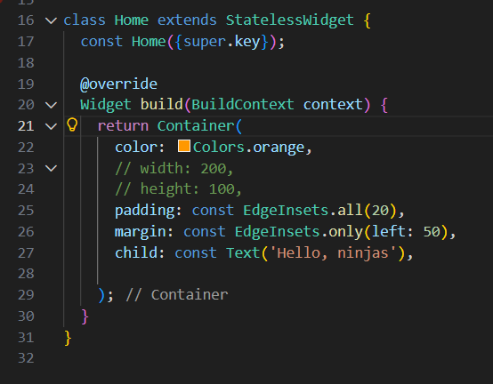

Output: 

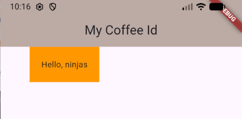

Code:

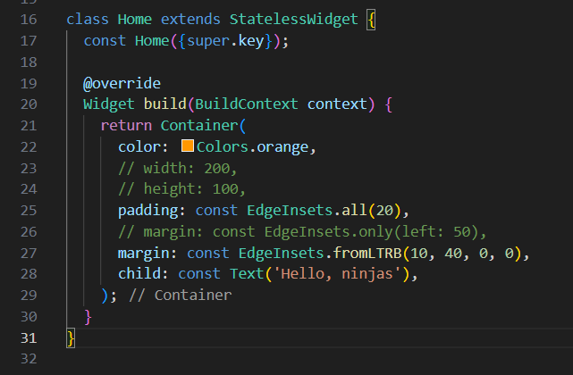

Output:

Code:

Output:

Reminder: If you're ever unsure of a value should be, hover over the argument name & look at what the property value should be

My link to code tinker: [Click the link](https://github.com/nancyc0337/apcsa-freedom-project/tree/main/flutter/five)

Link: [Flutter Crash Course #10 - Imports & Quick Refactor](https://youtu.be/FuTbF7DfECM?si=yIdKh4AWrMo8UGd4)

Notes: 

###### Rewrite

Code: 

Output:

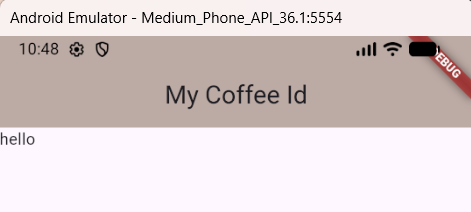

###### Imports

Code (main.dart):

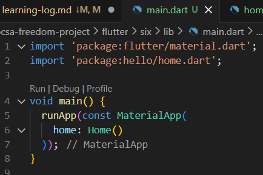

Code (home.dart): 

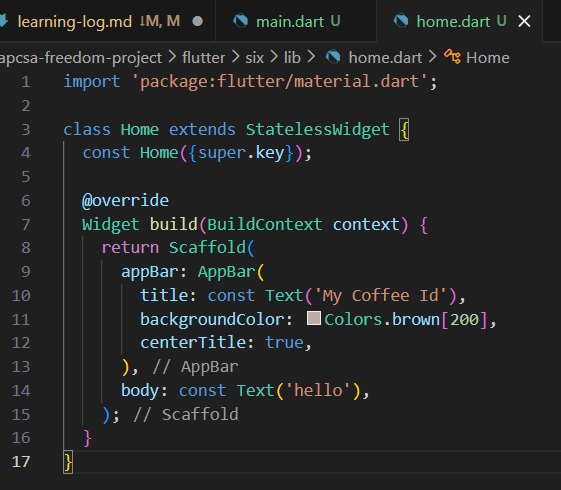

Output: 

* to get the import from another `.dart` file, click the yellow light bulb to see the content, click the first one & the import will pop up for you

My link to code tinker: [Click the link](https://github.com/nancyc0337/apcsa-freedom-project/tree/main/flutter/six)

##### 1/1/2026

Link: [Flutter Crash Course #11 - Columns](https://youtu.be/dLnwHbbhABE?si=gcMQCUIGkKIy9XHs)

Notes:

How the columns works:

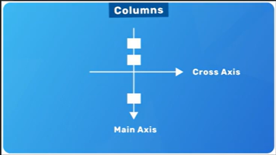

* If we want the columns going from top to bottom, we would use the main axis.
* If we want the columns going from left to right, we would use the cross axis.

* don't forget the `child` widget

Code:

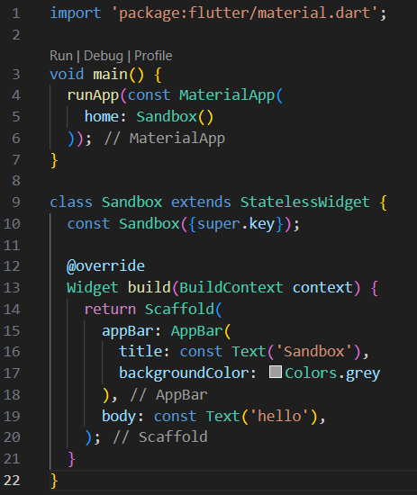

Output:

Code: 

default behavior: stack one on top of the other in the center

Output:

Code:

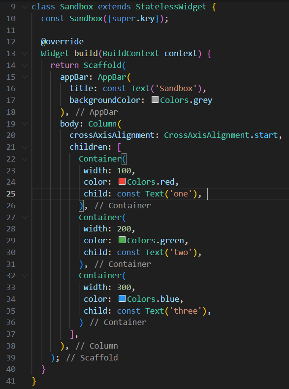

`crossAxisAlignment: CrossAxisAlignment.start,` shows the columns start at the left of the screen's column 

Output:

Code:

`crossAxisAlignment: CrossAxisAlignment.end,` shows the columns start at the right of the screen's column

Output:

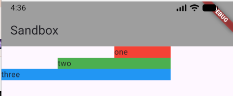

Code:

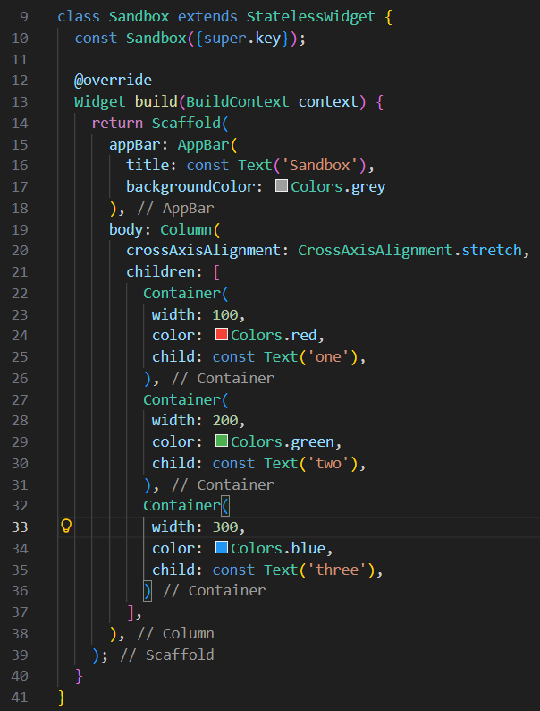

`crossAxisAlignment: CrossAxisAlignment.stretch,` stretches the columns 

Output:

Code:

`mainAxisAlignment: MainAxisAlignment.center,` sets the column in the center in the available room

Output: 

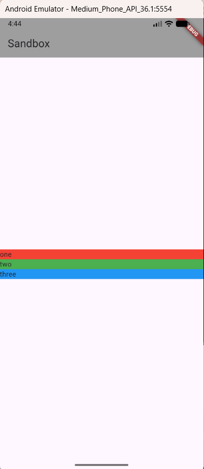

Code:

`mainAxisAlignment: MainAxisAlignment.end,` sets the column at the bottom of the available room

Output: 

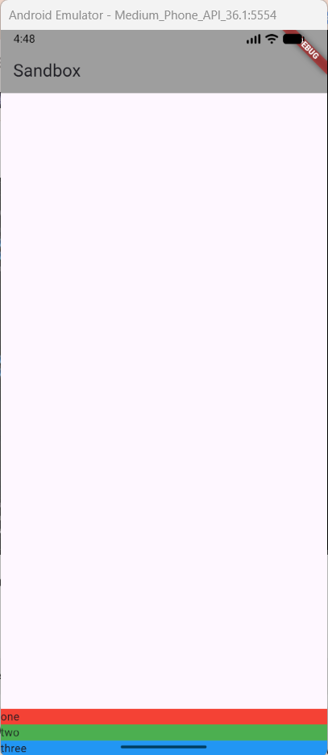

Code:

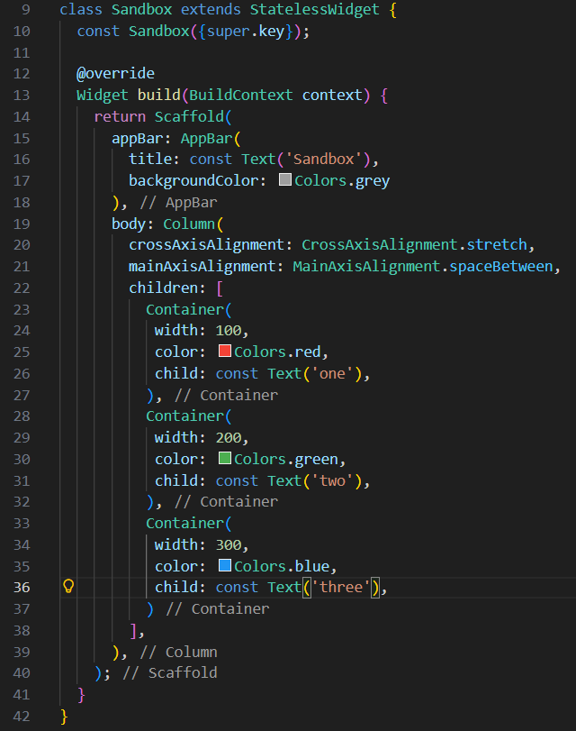

`mainAxisAlignment: MainAxisAlignment.spaceBetween,` sets the equal amount of space between each column in the available room

Output:

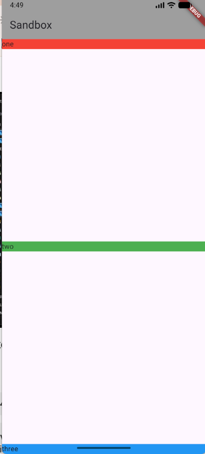

Code:

`mainAxisAlignment: MainAxisAlignment.spaceAround,` has space around the column

Output:

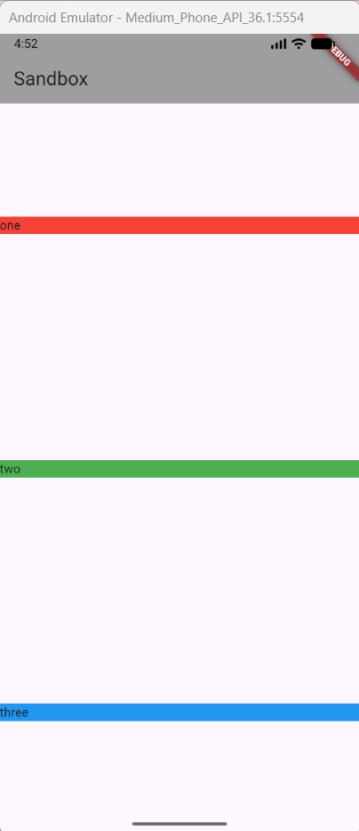

Code (home.dart): 

Output:

Code (home.dart): 

Output:

My link to code tinker: [Click the link](https://github.com/nancyc0337/apcsa-freedom-project/tree/main/flutter/seven)

Link: [Flutter Crash Course #12 - Rows](https://youtu.be/wVrEWw_Q-Wg?si=3ti2gtkuZddiyNTm)

Notes:

How the rows works:

* If we want the rows going from top to bottom, we would use the cross axis.
* If we want the rows going from left to right, we would use the main axis.

* don't forget the `child` widget

Code:

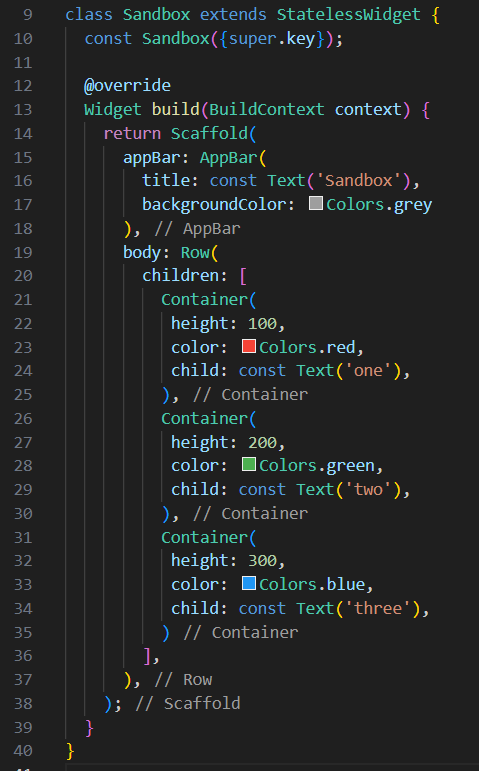

default: sets the rows in the center and to the left

Output:

Code:

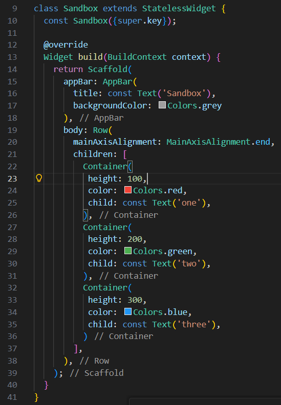

`mainAxisAlignment: MainAxisAlignment.end,` sets the rows to the end of the screen

Output:

Code:

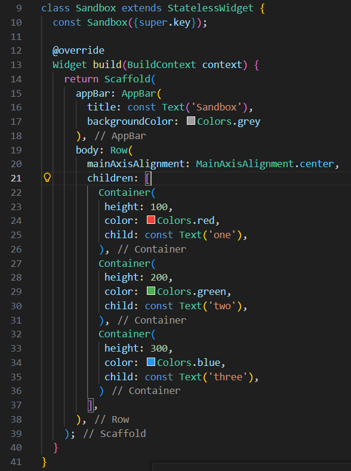

`mainAxisAlignment: MainAxisAlignment.center,` sets the rows to the center of the screen 

Output:

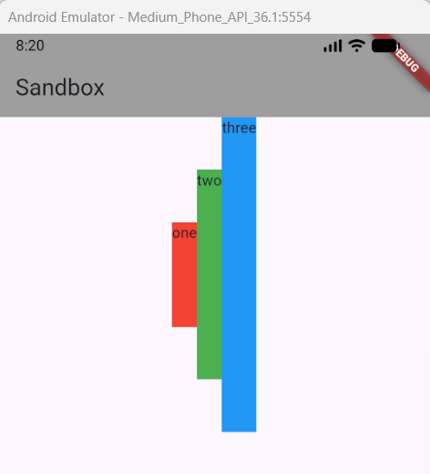

Code:

`crossAxisAlignment: CrossAxisAlignment.end,` sets the rows to the bottom of the screen

Output:

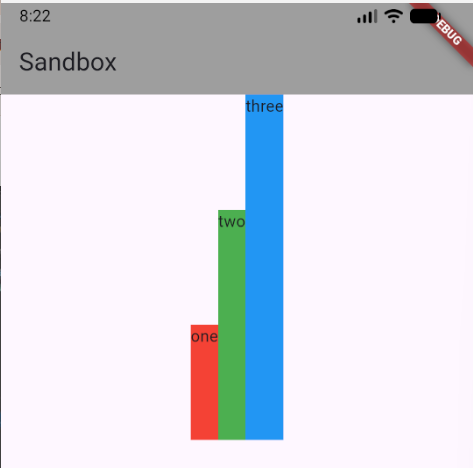

Code:

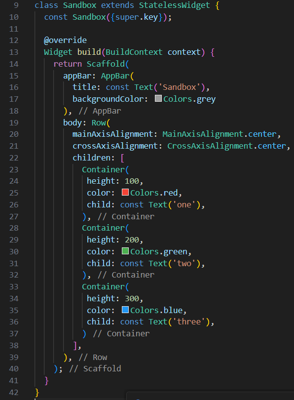

`crossAxisAlignment: CrossAxisAlignment.center` shows the rows in the center of the screen

Output: 

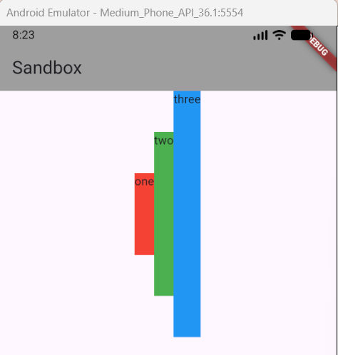

Code:

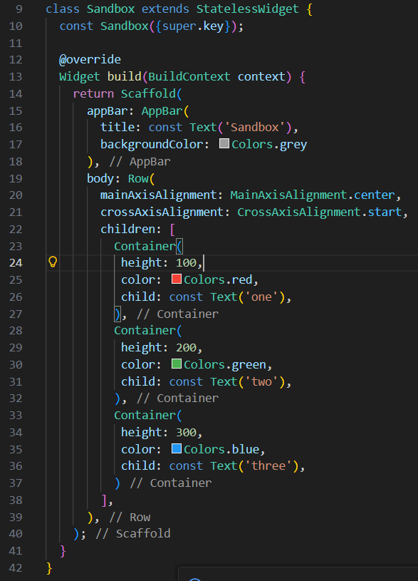

`crossAxisAlignment: CrossAxisAlignment.start,` shows the rows start at the top of the screen

Output:

Code:

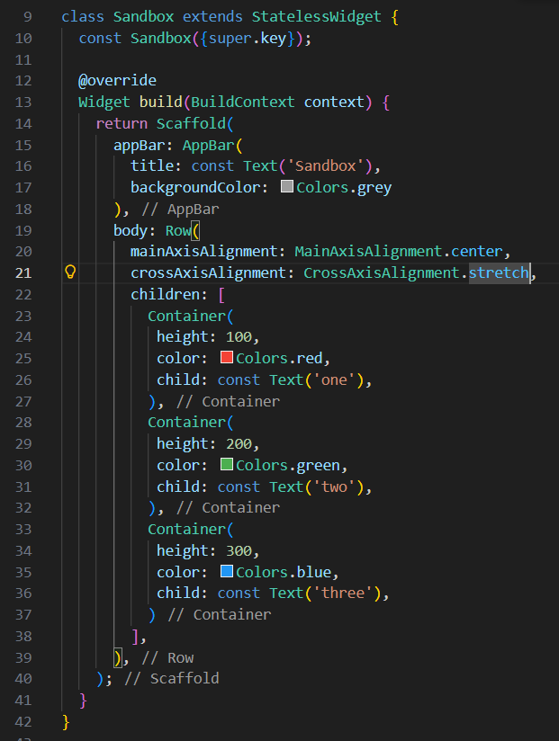

`crossAxisAlignment: CrossAxisAlignment.stretch,` stretches the whole row

Output:

Code: 

(coffee_prefs.dart)

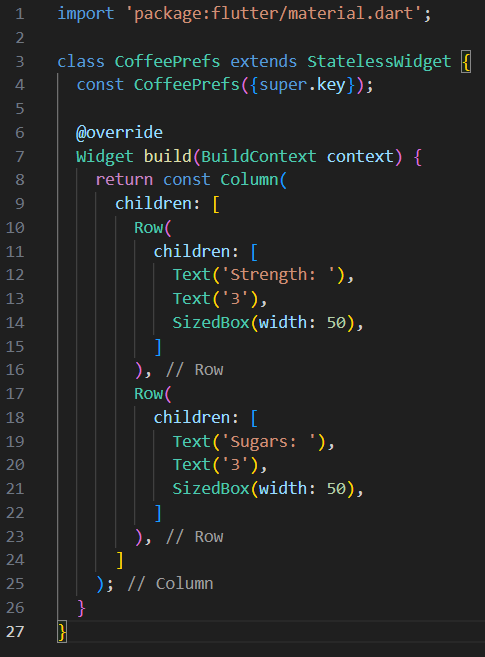

(main.dart)

(home.dart)

Output:

Code (coffee_prefs.dart):

We get 50 pixels of space between the texts.

Output:

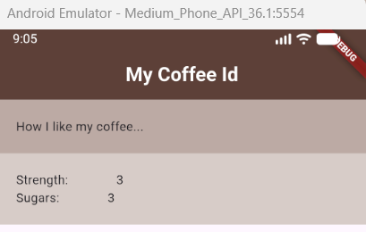

My link to code tinker: [Click the link](https://github.com/nancyc0337/apcsa-freedom-project/tree/main/flutter/eight)

##### 1/2/2026

Link: [Flutter Crash Course #13 - Images](https://youtu.be/u36eTxuGTsc?si=zVFy1bSciMR8g_0w)

Notes:

* make a folder named `assets`, and save the images in the `assets` folder

* add the imgs to assets in the file `pubspec.yaml`

How to add images:

`Image.asset('assets/image_filename'),`

Code (coffee_prefs.dart): 

Output: 

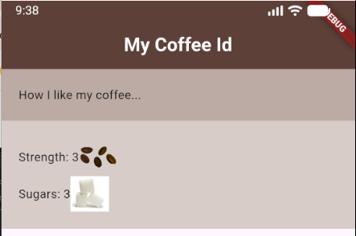

Code (coffee_prefs.dart):

* having the same color as the background + `colorBlendMode: BlendMode.multiply,` makes the image's background transparent

Output:

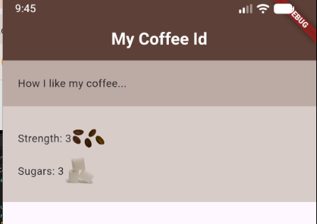

My link to code tinker: [Click the link](https://github.com/nancyc0337/apcsa-freedom-project/tree/main/flutter/nine)

Link: [Flutter Crash Course #14 - Expanded Widget](https://youtu.be/awQEMKzXBlo?si=-vX4ky3-oSiXO2Pn)

Notes:

Code (home.dart):

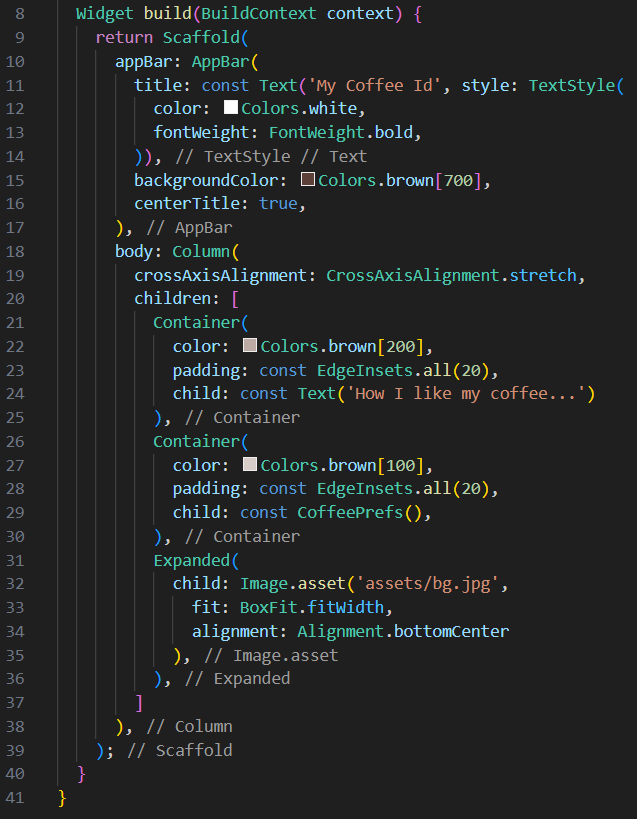

Code (coffee_prefs.dart): 

* Expanded Widget helps with expanding the image
* `fit: BoxFit.fitWidth,` & `alignment: Alignment.bottomCenter` help make the image fit in the available room of the screen
 
Output: 

My link to code tinker: [Click the link](https://github.com/nancyc0337/apcsa-freedom-project/tree/main/flutter/ten)

Link: [Flutter Crash Course #15 - Buttons & Press Events](https://youtu.be/Xqs_yHtxUiE?si=FjCpXNgD5IX5T-wM)

Notes:

[Click to see the Link to different button type in Flutter](https://api.flutter.dev/flutter/material/ButtonStyle-class.html)

* every button will have `onPressed` & `child` 

`onPressed` will show what happens when pressed

`child` will show what button looks like (ie: texts)

Code (coffee_prefs.dart): 

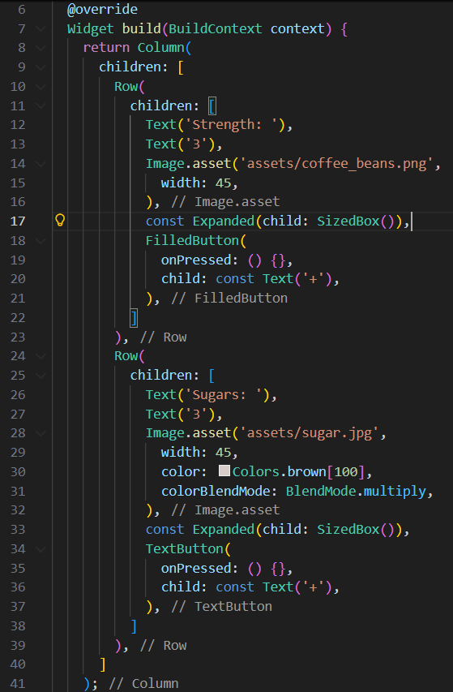

Output:

How to press & increase by 1:

Code (coffee_prefs.dart): 

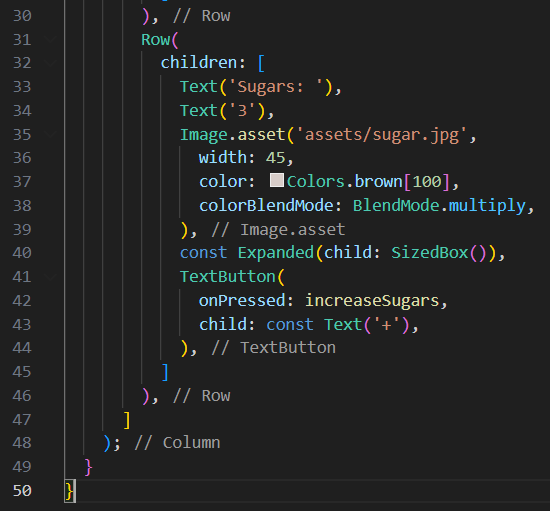

Output:

Code (coffee_prefs.dart): 

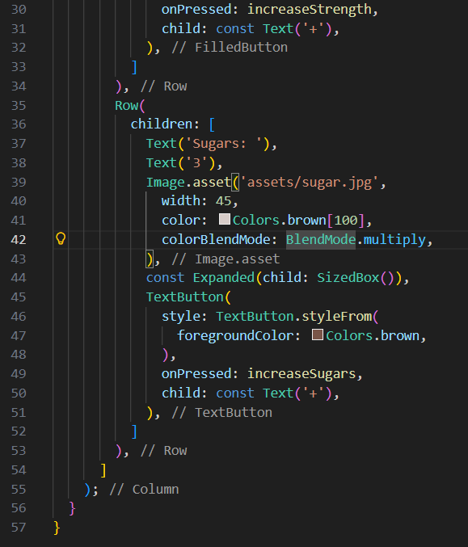

Output:

My link to code tinker: [Click the link](https://github.com/nancyc0337/apcsa-freedom-project/tree/main/flutter/eleven)

##### 1/3/2026

Link: [Flutter Crash Course #16 - Stateful Widgets](https://youtu.be/Ab6TWjayrR0?si=wnna-ZhkUFiWzVHZ)

Notes:

* stateful widget can contain states data / values that changes at some point and then triggers a rebuild of the widget tree in response to that state change to reflect it 

How to convert the state:

* click the yellow light bulb and click the convert to StatefulWidget
* It works the same for stateless as well

Code (coffee_prefs.dart):

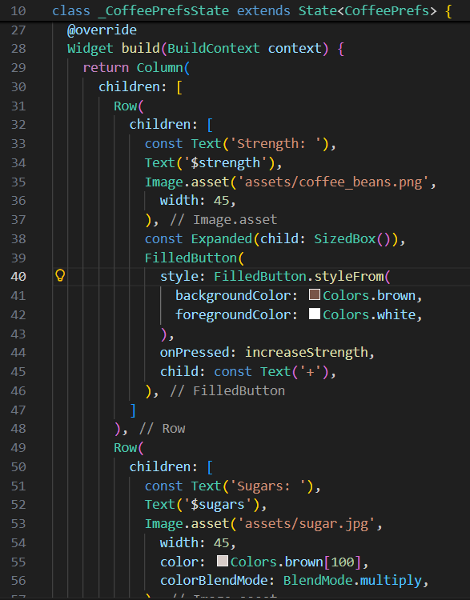

Output:

The number for the strength & sugars will increase by 1 when I click the + button. The number for the strength & sugars will restart back to 0 once it reaches 5. 

My link to code tinker: [Click the link](https://github.com/nancyc0337/apcsa-freedom-project/tree/main/flutter/twelve)

Link: [Flutter Crash Course #17 - Control Flow in Lists](https://youtu.be/SzMf_RjXSG4?si=RczAatuvdOgGtRZm)

Code (coffee_prefs.dart): 

(Strength)

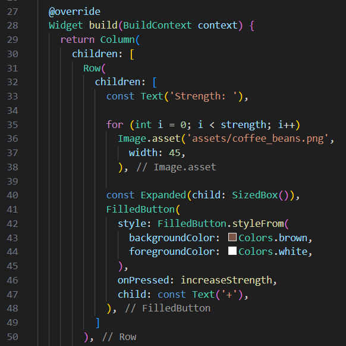

(Sugars)

Output: 

The strength is represented by coffee beans, and will increase by 1 when I click the + button. The coffee bean will restart back to 0 once it reaches 5. 

The sugars is represented by images of sugar cubes, and will increase by 1 when I click the + button. The sugar cubes will restart and say `No sugars...` once it reaches 5. 

My link to code tinker: [Click the link](https://github.com/nancyc0337/apcsa-freedom-project/tree/main/flutter/thirteen)

##### 1/4/2026

Link: [Flutter Crash Course #18 - Making Re-usable Widgets](https://youtu.be/i6ZiiYJpuEk?si=ZvpUF6p_qs_HYHNt)

Notes:

Re-usable Widgets can let us reuse the widget that we are using and we can change the value as we like. 

1. making the text widget re-usable

Code:

(home.dart)

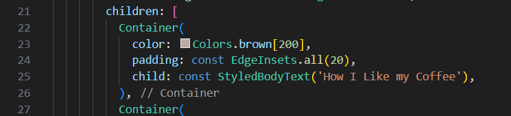

(styled_body_text.dart)

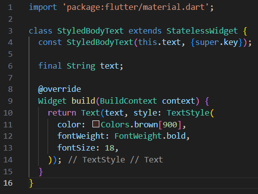

Output:

2. making the button re-usable

Code: 

(coffee_prefs.dart)

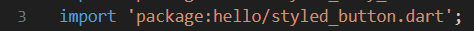

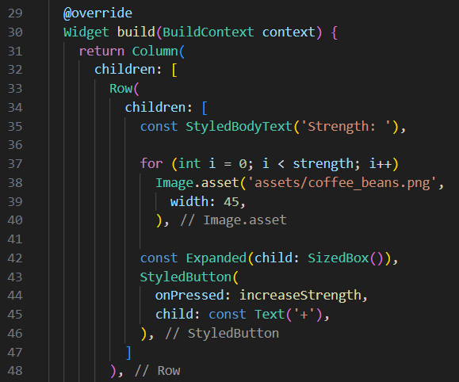

(styled_button.dart)

Output:

My link to code tinker: [Click the link](https://github.com/nancyc0337/apcsa-freedom-project/tree/main/flutter/fourteen)

## Sources

My first resource is from my IDE/Github, where I stored & tinkered with my tool (tool folder): [Link To My Tool Folder](https://github.com/nancyc0337/apcsa-freedom-project/tree/main/tool).

My second resource is from my IDE/Github, where I wrote down my progress of what I did with my tool: [Link To My Learning Log](https://github.com/nancyc0337/apcsa-freedom-project/blob/main/tool/learning-log.md).

My third resource is from my IDE/Github, where I tinkered with my tool: [Link To My Tinkering](https://github.com/nancyc0337/apcsa-freedom-project/tree/main/flutter).

My fourth resource is a website about Flutter: [Link To flutter.dev](https://flutter.dev/).

My fifth resource is a Flutter Tutorials playlist from Youtube that I found: [Link To The Flutter Crash Course](https://youtube.com/playlist?list=PL4cUxeGkcC9giLVXCHSQmWqlHc9BLXdVx&si=ukFdAKzmSUXAv6PO).

## Engineering Design Process

Right now in the Engineering Design Process(EDP), I am on the 5th step(Create a prototype). Currently, we are using many resources to learn our tool to make our project. I think I'll be on 6th step(Test and evaluate the prototype), using what we learned about our tool to create our game.

## Skills

1) 

The 1st skill I learned during this process is ****.

2) 

The 2nd skill I learned during this process is ****.

## Summary

[Previous](entry02.md) | [Next](entry04.md)

[Home](../README.md)