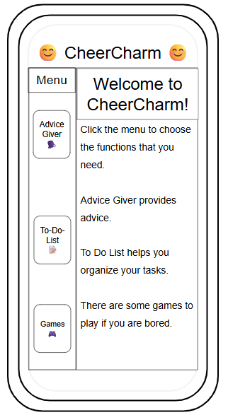
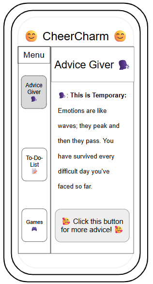
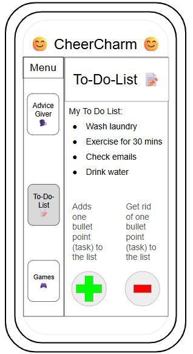
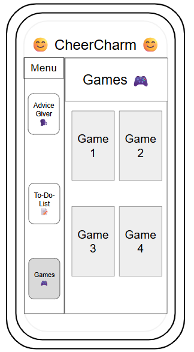
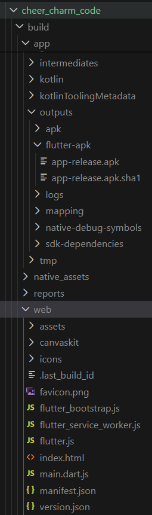
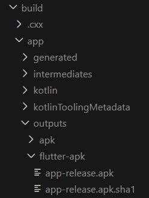
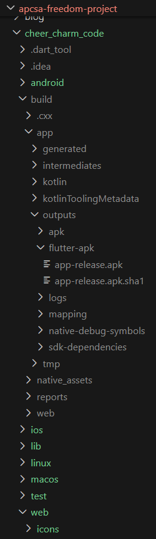
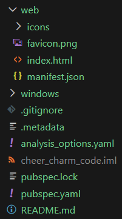
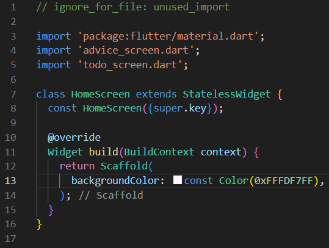

# Entry 4: Creating Plan & Code for CheerCharm (MVP)
##### 3/9/2026

## Content: Creating Plan & Making My MVP

On February 9, we created our Freedom Project MVP Plan in our [plan.md](https://github.com/nancyc0337/apcsa-freedom-project/blob/main/prep/plan.md).

### Plan

### Tool: Flutter

### Product: Multifunctional App (Name: CheerCharm)

It will have 2-3 functions.

First function is it can give the user motivation quotes/advice.

Second function is the user can make a "to do list" for organization.

Third function (beyond MVP) is if bored, the user can play some games in the "games" section.

The purpose is to make a project to make people less depressed!

---

#### Timeline

#### MVP

(February 14-22)-(break)
- [x] learn `API integration, state management, and UI design` through [API Integration in Flutter | Flutter App Tutorial](https://youtu.be/tLkw7YJ996I?si=-SOJ_Rn4dbWwh0Ql)
- [x] watch this [YouTube Tutorial](https://youtube.com/playlist?list=PLesyDHXnnTyM5nC88Ebh8KnUdxu6cvCDJ&si=avrEICKHiDTky2KP)
- [x] I will learn to code some games with Flutter.

(February 23-March 15): Main/Home screen & Advice-Generator

- [] make Main/Home screen to navigate
- [] make menu to navigate through the app
- [] make Advice-Generator

(March 16-April 5): To-do-list

- [] continue to make Advice-Generator
- [] make to-do-list

#### Beyond MVP

(April 6-13): make final edits and/or make Flutter games for project
- [] make some games using Flutter
- [] edit bugs
- [] make final edits

#### Wireframes

##### Home Screen

##### Advice Giver Screen

##### To-Do-List Screen

##### Games Screen

#### Links (helps me with picking colors for project)

1) [16 Calming Colors That Help You Relax
](https://www.color-meanings.com/calming-colors-relax/)

2) [Shades of Colors](https://htmlcolorcodes.com/colors/)

On March 8, I started making CheerCharm!

### Learning Log 8

I started making the code for my freedom project.

First, I made the project in my repo.

#### My steps

In my Visual Studio Code, I did these steps to make my code for my project.

1) Press `Ctrl` + `Shift` + `P`

2) Type `Flutter: New Project`

3) Choose Application

4) Name it: cheer_charm_code

5) Choose where to save it

6) Wait for Flutter to generate everything

I was thinking ...

How I can share my project with a link or how people can use my project on their phone?

1) Share it as a Web App

I wanted others to use my app with a link, so I build it with this command: `flutter build web`.

It created a folder `build/web`.

2) Share an Android APK

I also wanted people to use my app on their phones, so I build the APK with this command: `flutter build apk --release`.

I got: `build/app/outputs/flutter-apk/app-release.apk`

My `cheer_charm_code` paths:

After I build a web application and build an APK file, I started the code for the Home screen for the user to navigate.

Links that I used:
* [How to Build an APK File in Flutter using VS Code | Super Easy 2026](https://youtu.be/iUH_HGytKyQ?si=zFRfW0RiALfjvG4_)
* [How to Build a Flutter APK: A Step-by-Step Guide](https://blog.seeb4coding.in/how-to-build-a-flutter-apk-a-step-by-step-guide/?utm_source=copilot.com#google_vignette)
* [Build and release a web app](https://docs.flutter.dev/deployment/web?utm_source=copilot.com)
* [Building a web application with Flutter](https://docs.flutter.dev/platform-integration/web/building?utm_source=copilot.com)

## Sources

My first resource is from my IDE/Github, where I stored & tinkered with my tool (tool folder): [Link To My Tool Folder](https://github.com/nancyc0337/apcsa-freedom-project/tree/main/tool).

My second resource is from my IDE/Github, where I wrote down my progress of what I did with my tool: [Link To My Learning Log](https://github.com/nancyc0337/apcsa-freedom-project/blob/main/tool/learning-log.md).

My third resource is from my IDE/Github, where I tinkered with my tool: [Link To My Tinkering](https://github.com/nancyc0337/apcsa-freedom-project/tree/main/flutter).

My fourth resource is a website about Flutter: [Link To flutter.dev](https://flutter.dev/).

My fifth resource is my MVP Plan: [Link To My MVP Plan](https://github.com/nancyc0337/apcsa-freedom-project/blob/main/prep/plan.md).

My sixth resource is my code to CheerCharm: [Link To The CheerCharm Code](https://github.com/nancyc0337/apcsa-freedom-project/tree/main/cheer_charm_code).

### Sources for Learning Log 8 & 1st Entry of Making CheerCharm

My first resource is a YouTube video: [How to Build an APK File in Flutter using VS Code | Super Easy 2026](https://youtu.be/iUH_HGytKyQ?si=zFRfW0RiALfjvG4_)

My second resource is a blog: [How to Build a Flutter APK: A Step-by-Step Guide](https://blog.seeb4coding.in/how-to-build-a-flutter-apk-a-step-by-step-guide/?utm_source=copilot.com#google_vignette)

My third resource is the Flutter website: [Build and release a web app](https://docs.flutter.dev/deployment/web?utm_source=copilot.com)

My fourth resource is the Flutter website: [Building a web application with Flutter](https://docs.flutter.dev/platform-integration/web/building?utm_source=copilot.com)

## Engineering Design Process

Right now in the Engineering Design Process(EDP), I am on the 6th step(Test and evaluate the prototype), using what we learned about our tool to create our game. We created a plan to organize and prioritize our tasks for our MVP(Minimum Visible Product).

My Link to my Freedom Project MVP Plan: [Freedom Project MVP Plan](https://github.com/nancyc0337/apcsa-freedom-project/blob/main/prep/plan.md)

## Skills

1) Time management

The 1st skill I learned during this process is **Time management**.

We made a [MVP Plan](https://github.com/nancyc0337/apcsa-freedom-project/blob/main/prep/plan.md) to prioritize and schedule our tasks for our MVP. We're now working on our MVP. I will be following my plan to make CheerCharm.

2) Problem decomposition

The 2nd skill I learned during this process is **Problem decomposition**.

When I was making my [MVP Plan](https://github.com/nancyc0337/apcsa-freedom-project/blob/main/prep/plan.md), I broke my goal (making my app (CheerCharm)) into smaller tasks.

## Summary

In conclusion, I will continue to work on my MVP in [cheer_charm_code_folder](https://github.com/nancyc0337/apcsa-freedom-project/tree/main/cheer_charm_code) using my [MVP plan](https://github.com/nancyc0337/apcsa-freedom-project/blob/main/prep/plan.md).

[Previous](entry03.md) | [Next](entry05.md)

[Home](../README.md)
