# Entry 5: Finishing Our MVP (Minimum Viable Product)
##### 4/13/2026

## Content: How I Finished My MVP (Minimum Viable Product)

After March 8, I continued to work on my MVP.

### 3/21/2026: Learning Log 9

I made the code for the file [`home_screen.dart`](https://github.com/nancyc0337/apcsa-freedom-project/blob/main/cheer_charm_code/lib/home_screen.dart).

I made a permanent menu that won't close, the menu has 2 buttons. One has the `Advice Generator`, and another has the `To-Do List`.

Output:

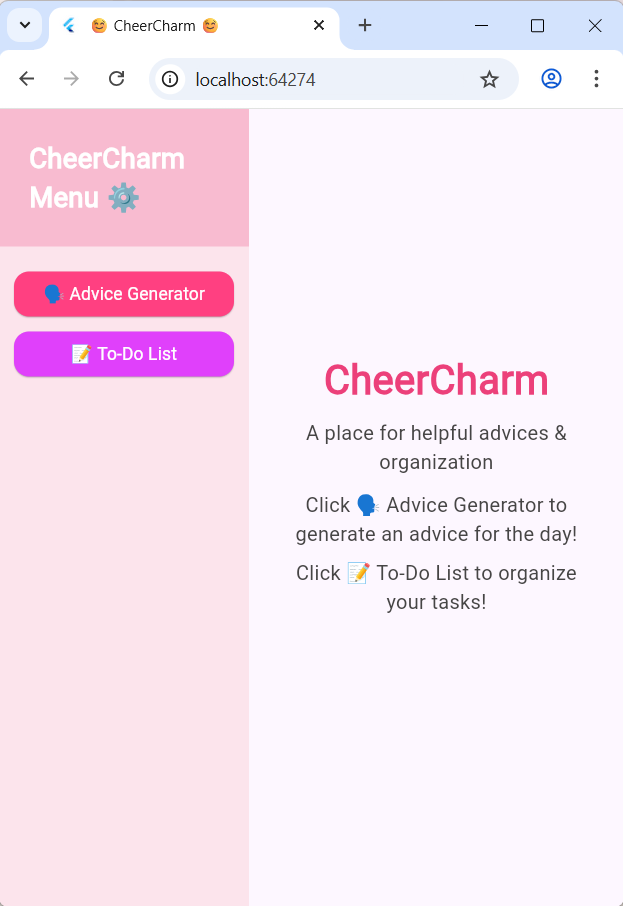

Plan:
* start coding the advice-generator (3/23-3/29)
* start coding the to-do list (spring break)
* code a function where the app asks the user "What is your favorite color?" (spring break)
  * Then using the user's input to change the background

### 3/29/2026: Learning Log 10

What I did: I made the code for advice-generator.

Ever since March 16 2026, I started gathering advices, affirmations, etc, from the social media that I use (YouTube & Instagram). I saved them in a Google Doc.

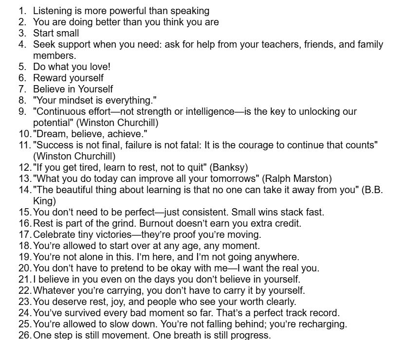

I copied the advices that I saved, made a file `advice.json`, and saved in assets folder.

Challenge: The Android Emulator won't run

Process of fixing the challenge:

`Terminal`

`Android Studio`

I went to my `Android Studios` and fixed my Flutter build.

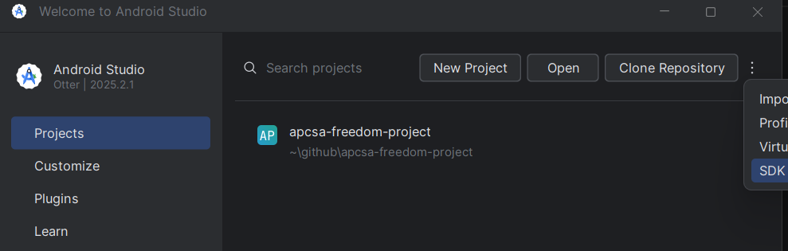

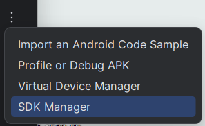

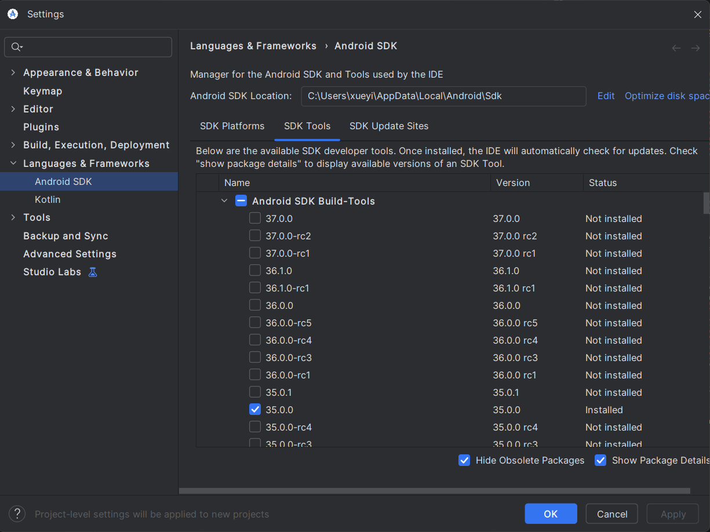

I clicked the version 34.0.0 and unchecked 36.1.0 version. I clicked apply and ok. The `Android Studio` installed the correct build-tools for me.

Output:

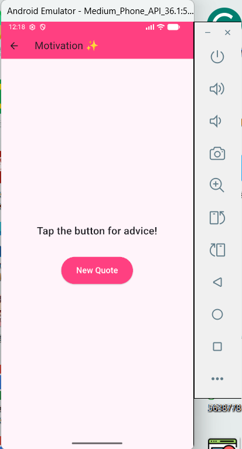

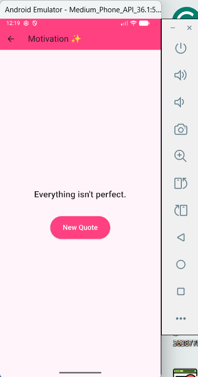

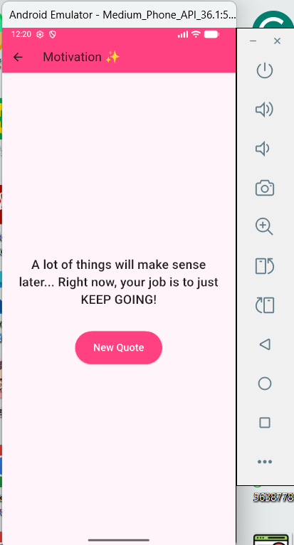

Plan:
* start coding the to-do list (spring break)
* code a function where the app asks the user "What is your favorite color?" (spring break)
  * Then using the user's input to change the background

I finished the MVP on April 11.

Link to my preview of the MVP (video demonstration): [Click here to see the video demonstration of my MVP](https://drive.google.com/file/d/1Hp8UZmx--oHUg5EkzFUI2TYGdnaKl5jv/view?usp=sharing)

## Sources

My first resource is from my IDE/Github, where I wrote down my progress of what I did with my tool: [Link To My Learning Log](https://github.com/nancyc0337/apcsa-freedom-project/blob/main/tool/learning-log.md).

My second resource is a website about Flutter: [Link To flutter.dev](https://flutter.dev/).

My third resource is my MVP Plan: [Link To My MVP Plan](https://github.com/nancyc0337/apcsa-freedom-project/blob/main/prep/plan.md).

My fourth resource is my code to CheerCharm: [Link To The CheerCharm Code](https://github.com/nancyc0337/apcsa-freedom-project/tree/main/cheer_charm_code).

### Sources for Learning Log 9 & 2nd Entry of Making CheerCharm

My first resource is from the Flutter website: [New Buttons and Button themes](https://docs.flutter.dev/release/breaking-changes/buttons)

My second resource is from the Flutter website: [ElevatedButton class](https://api.flutter.dev/flutter/material/ElevatedButton-class.html)

My third resource is from the Flutter website: [SizedBox class](https://api.flutter.dev/flutter/widgets/SizedBox-class.html)

### Sources for Learning Log 10 & 3rd Entry of Making CheerCharm

My first resource is from the Flutter website: [`dart:math`](https://api.flutter.dev/flutter/dart-math/).

My second resource is from the Flutter website: [Building user interfaces with Flutter](https://docs.flutter.dev/ui#stateful-and-stateless-widgets).

My third resource is from the Flutter website: [`setState` method](https://api.flutter.dev/flutter/widgets/State/setState.html).

My fourth resource is from the Flutter website: [Transforming assets at build time](https://docs.flutter.dev/ui/assets/asset-transformation).

### Sources for 4th Entry of Making CheerCharm

My first resource is a link that helped me with my to-do-list function: [Link that helped me with my To-Do-List function](http://buildandteach.com/2024/11/26/simple-flutter-app-todo-list-app/).

## Engineering Design Process

Right now in the Engineering Design Process(EDP), I am on the 6th step(Test and evaluate the prototype), using what we learned about our tool to create our MVP.

Link to my preview of the MVP (video demonstration): [Click here to see the video demonstration of my MVP](https://drive.google.com/file/d/1Hp8UZmx--oHUg5EkzFUI2TYGdnaKl5jv/view?usp=sharing)

## Skills

1) Time management & Problem decomposition

The 1st skill and 2nd skill I learned during this process is **Time management** and **Problem decomposition**.

I followed my [MVP Plan](https://github.com/nancyc0337/apcsa-freedom-project/blob/main/prep/plan.md) to make my Freedom Project.

First, I made the home page, where the user can navigate through either the **Quote Generator** or the **To-Do List** functions. The user will also see the description of the app "A place for helpful advices/affirmations/quotes & organization" and how to navigate through the app "Click 🗣️ Quote Generator to generate a quote for the day!" & "Click 📝 To-Do List to organize your tasks!".

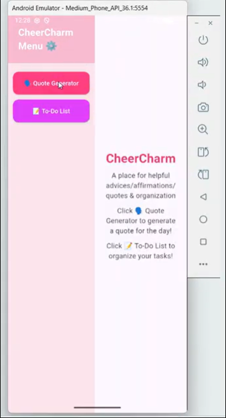

Next, I made the **Quote Generator** function.

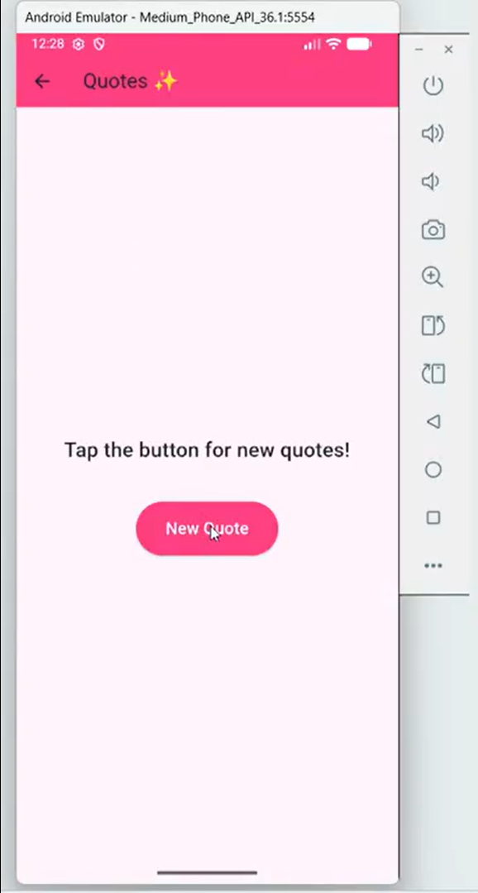

After that, I made the **To-Do List** function.

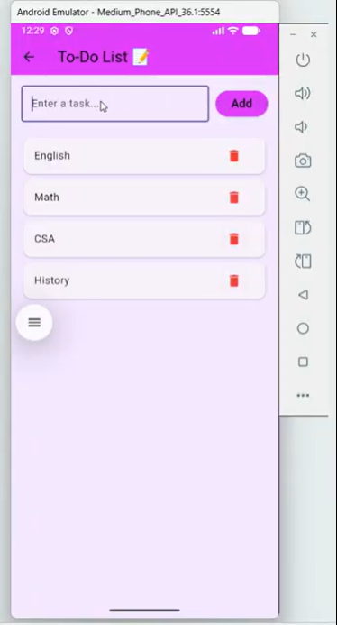

### Challenge: The Android Emulator won't run

Process of fixing the challenge:

`Terminal`

`Android Studio`

I went to my `Android Studios` and fixed my Flutter build.

I clicked the version 34.0.0 and unchecked 36.1.0 version. I clicked apply and ok. The `Android Studio` installed the correct build-tools for me.

Output:

2) Growth mindset

Ever since March 16 2026, I started gathering advices, affirmations, etc, from the social media that I use (YouTube & Instagram). I saved them in a Google Doc.

I copied the advices that I saved, made a file [`advice.json`](https://github.com/nancyc0337/apcsa-freedom-project/blob/main/cheer_charm_code/assets/advice.json), and saved in [assets](https://github.com/nancyc0337/apcsa-freedom-project/tree/main/cheer_charm_code/assets) folder.

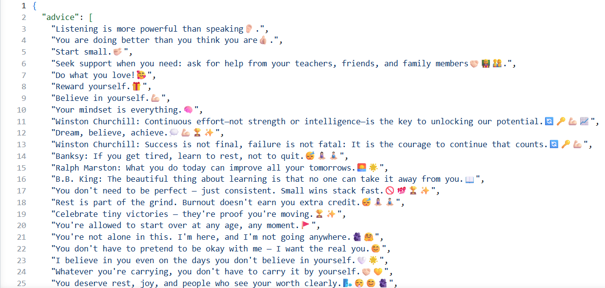

I have about 600 quotes saved, and coding the quotes in the [`advice.json`](https://github.com/nancyc0337/apcsa-freedom-project/blob/main/cheer_charm_code/assets/advice.json) file took me some time.

## Summary

In conclusion, I will start to work on my beyond MVP in [cheer_charm_code_folder](https://github.com/nancyc0337/apcsa-freedom-project/tree/main/cheer_charm_code) using my [MVP plan](https://github.com/nancyc0337/apcsa-freedom-project/blob/main/prep/plan.md).

[Previous](entry04.md) | [Next](entry06.md)

[Home](../README.md)
