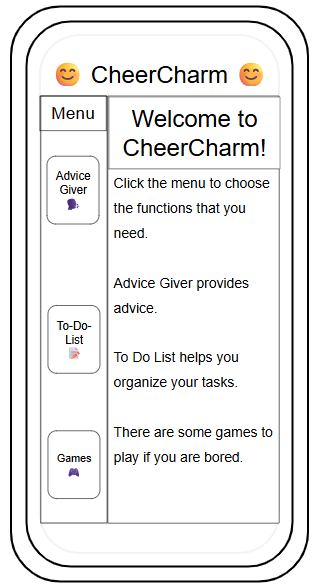

# Plan

## Tool: Flutter

## Product: Multifunctional App (Name: CheerCharm)

It will have 2-3 functions.

First function is it can give the user motivation quotes/advice.

Second function is the user can make a "to do list" for organization.

Third function (beyond MVP) is if bored, the user can play some games in the "games" section.

The purpose is to make a project to make people less depressed!

---

## Timeline

#### MVP

(February 14-22)-(break)
- [] learn `API integration, state management, and UI design` through [API Integration in Flutter | Flutter App Tutorial](https://youtu.be/tLkw7YJ996I?si=-SOJ_Rn4dbWwh0Ql)
- [] watch this [YouTube Tutorial](https://youtube.com/playlist?list=PLesyDHXnnTyM5nC88Ebh8KnUdxu6cvCDJ&si=avrEICKHiDTky2KP)
- [] I will learn to code some games with Flutter.

(February 23-March 15): Main/Home screen & Advice-Generator

- [] make Main/Home screen to navigate
- [] make menu to navigate through the app
- [] make Advice-Generator

(March 16-April 5): To-do-list

- [] continue to make Advice-Generator
- [] make to-do-list

#### Beyond MVP

(April 6-13): make final edits and/or make Flutter games for project
- [] make some games using Flutter
- [] edit bugs
- [] make final edits

#### Wireframes

#### Links (helps me with picking colors for project)

1) [16 Calming Colors That Help You Relax
](https://www.color-meanings.com/calming-colors-relax/)

2) [Shades of Colors](https://htmlcolorcodes.com/colors/)

<!-- EXAMPLE

## Tool: APIs
## Product: Green Glass Door riddle app

## Timeline

### MVP

- [ ] Front-end
  - [x] Webpage to collect input from user (deadline: 4/15)
  - [ ] Webpage to display "yes, but a ___ can't" or "no, but a ___ can" (deadline: 5/1)
- [x] Back-end
  - [x] Use regex to test whether or not the word can go through the GGD (deadline: 3/1)
  - [x] Use the Twinword API to find related words (deadline: 3/15)
    - [ ] Iterate through the words until an opposite example can be found (deadline: 4/1)

#### Beyond MVP

- [ ] Use another API to make sure the opposite example is a noun
- [ ] Automate notification of API limit to make sure I don’t exceed free quota
- [ ] A multiple choice quizzer that will test the user’s knowledge of the solution

-->

<!-- DO NOT USE THIS YET

#### Peer Feedback

| Name | Glows | Grows |
| -------- | ------- | ------- |
|  |  |  |
|  |  |  |
|  |  |  |
|  |  |  |
|  |  |  |

-->
