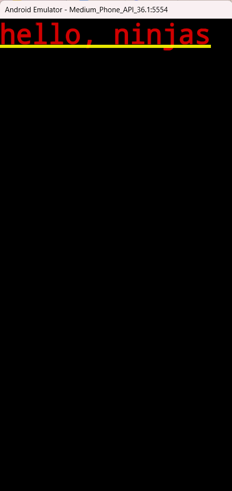
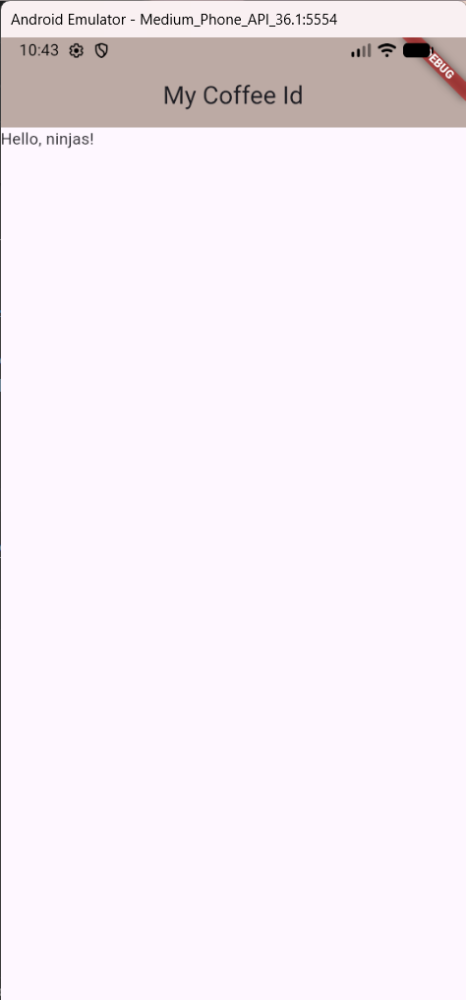
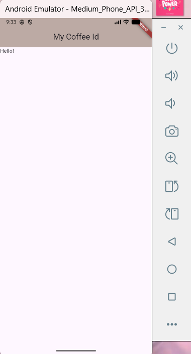
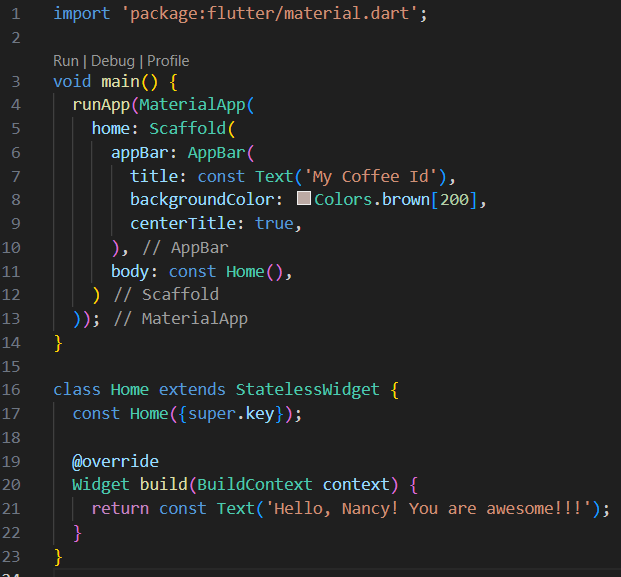

# Tool Learning Log

## Tool: **Flutter**

## Project: **CheerCharm ☺️**
### Idea: an app

What it can do:
* It can give the user motivation quotes/advice.
* The user can make a “to do list” for organization.
* If bored, the user can play some games in the “games” section.

Purpose:
* The purpose is to make a project to make people less depressed!
---

### 10/5/2025:

Link: [Flutter Crash Course #1 - What is Flutter?](https://youtu.be/j_rCDc_X-k8?si=7SZVABDTw0zlmIqr)

Notes:

What is Flutter?
* a framework for creating cross-platform applications

It's for Android, iOS, Desktop, and Web.

It's written using the Dart programming language & takes advantage of Material Design features.

It has similar layout principles to CSS.

This is a website, which is the official package repository for darts & flutter: [A website for packages](pub.dev)

Flutter website: [Flutter codes & examples](https://docs.flutter.dev/)

Link: [Flutter Crash Course #2 - Installing on Windows](https://youtu.be/DvZuJeTHWaw?si=OveUKH7cdz3vChn_)


My Install Flutter Progress:


My link to code tinker: [Click the link](https://github.com/nancyc0337/apcsa-freedom-project/tree/main/flutter/one)

### 10/27/2025 & 11/2/2025:

Link: [Flutter Crash Course #4 - Making a New Flutter Project](https://youtu.be/adNHZVBd284?si=CT8Yu91mnqcQ_Z4Q)

Notes:

To make up a brand new flutter project:
* navigate to the directory that you want to create the project in

! try not to have any directory with any spaces or special characters.

use _ if need to use space

`flutter create name` = creates the project

`flutter run` = runs the project

Click mobile emulator, Start the name of the emulator, it'll show an iphone, will demonstrate how our code will show on our phone.

Since I didn't have the emulator, I have to download android studio: https://developer.android.com/studio.

Pictures of downloading the android studio:


This is where & what my code will show:


Link: [Flutter Crash Course #5 - Quick Project Overview](https://youtu.be/qdyt8UO-MqM?si=4hUVkXfj3QYbpOh3)

Notes:

* inside the `lib` folder, there should be a `main.dart` file 
  * mostly where all my application is going to be 
  * where I'm going to do most of my coding

Code #1: 

``` flutter
void main() {
  runApp(const MyApp());
}
```
Explanation: 
* my Kickstart of my application
* runs automatically 
* `runApp` actually runs the application

In `runApp`, there we can have a variable that we can use as a class and use it as an argument (root widget).

Code #2: 

``` flutter
@override
  Widget build(BuildContext context) {
    return MaterialApp(
      title: 'Flutter Demo',
      theme: ThemeData(
        colorScheme: ColorScheme.fromSeed(seedColor: Colors.deepPurple),
      ),
      home: const MyHomePage(title: 'Flutter Demo Home Page'),
    );
  }
```
Explanation: 
* `Widget build(BuildContext context) {}` = root of my application 
* `home: const MyHomePage(title: 'Flutter Demo Home Page'),` = title on my application 

* `title: Text(widget.title),` = title

* `body: Center()` = Center is a layout widget. It takes a single child and positions it in the middle of the parent.

* `child: Column()` = Column is also a layout widget. It takes a list of children and arranges them vertically. By default, it sizes itself to fit its children horizontally, and tries to be as tall as its parent.

Link: [Flutter Crash Course #6 - Widgets](https://youtu.be/L0izVqsaxLI?si=4Gnkv4zZsbDYvzpF)

Notes: 

What is a widget? 
* Widget is actually just a class

* `class MyApp extends StatelessWidget {}`

Explanation:
* stateless means this widget won't contain any state / data which changes over time / in response to something like user clicking on a button...

* if we want to output an image = use an image widget
* if we need a container for a layout = use a container widget
* if we need a column for a layout = use a column widget
* we can also make our own custom widget

... 

Widget Tree:


* most widgets will be pre-made or customable

My link to code tinker: [Click the link](https://github.com/nancyc0337/apcsa-freedom-project/tree/main/flutter/one)

### 11/16/2025:

Link: [Flutter Crash Course #7 - MaterialApp & Scaffold](https://youtu.be/U0vS27vqKSo?si=KNA8m3Xi48GprdTU)

Notes:

`runApp(MaterialApp());` 
* prebuilt widget
* acts like a wrapper 
* applies Google's material design styles / makes them available to all of the built-in core widgets like buttons, app bars, text...

`import 'package:flutter/material.dart';`
* core package provided by flutter 
  * no need to install anything extra
  
! on top of the **main.dart** file, starter code 

* material app widget accepts a bunch of different optional named arguments when we use it


For any widget I hover over: The arguments are white & respective types are in green.  

If we hover the argument name, we can see some information about it. 


``` flutter
void main() {
  runApp(const MaterialApp(
    home: Text('hello, ninjas'),
  ));
}
```

* `constant` = it knows that the value won't change after compile time
  * therefore if the widget tree ever gets rebuilt anything with a constant in front of it can be reused again rather than rebuilt from scratch
  * flutter knows it's a constant and its value is always going to be the same

* we can optimize performance by making something a constant 
* you might also see red error lines when something that was previously a const cannot be one anymore where we might have changed something within that widget in which case we just remove the const keyword



It shows really horrible looking text at the top with a double yellow line underneath it.

My link to code tinker: [Click the link](https://github.com/nancyc0337/apcsa-freedom-project/tree/main/flutter/two)

### 11/23/2025:

Link: [Flutter Crash Course #7 - MaterialApp & Scaffold](https://youtu.be/U0vS27vqKSo?si=KNA8m3Xi48GprdTU)

Notes:

Link: https://api.flutter.dev/flutter/material/MaterialApp-class.html

Problem: Text widgets that lack a Material ancestor will be rendered with an ugly red/yellow text style.

Solution: The typical fix is to give the widget a Scaffold ancestor. The Scaffold creates a Material widget that defines its default text style.

``` flutter
appBar: AppBar(
  title: const Text('My Coffee Id'),
  backgroundColor: Colors.brown[200],
  centerTitle: true,
),
body: const Text('Hello, ninjas!'),
```
Explanation: 
* `title: const Text('My Coffee Id'),` = prints out the text "My Coffee Id"
* `backgroundColor: Colors.brown[200],` = gives out the background color & the value inside [] shows the darkness/lightness of the color
* `centerTitle: true,` = title is in the center of the screen 
* `body: const Text('Hello, ninjas!'),` = the text will print in the body

My output of my code: 



My link to code tinker: [Click the link](https://github.com/nancyc0337/apcsa-freedom-project/tree/main/flutter/two)

### 12/7/2025: 

Link: [Flutter Crash Course #8 - Stateless Widgets](https://youtu.be/tDKgJEvhaP8?si=dBIKE5gKsaySj9_q)

Notes:

To get a new stateless widget:
* type stl & then hitting tab

(stl means stateless)

Then this should pop up:

```flutter
class MyWidget extends StatelessWidget {
  const MyWidget({super.key});

  @override
  Widget build(BuildContext context) {
    return const Placeholder();
  }
}
```

* I should start my class names with a captial letter

`extends StatelessWidget` = it inherits all the functionality that a stateless widget should have in flutter 
* stateless means the widget won't contain any state that changes over time or in reaction to maybe an user event

`const MyWidget({super.key});` = constructor for the class
* takes in a single argument called key (defined within the widget class it inherits from)
  * `{super.key}` passes that key to its parent class 
  * all widgets in flutter have this optional key argument

``` flutter
@override
Widget build(BuildContext context) {
  return const Placeholder();
}
```
* build function, should return a widget/widget tree 

`@override` = override declaration, overriding the inherited version of the function
* the function also exists on the parent class that we extend inside the function 
  * inside the override declaration, we automatically get access to a build context object as a parameter 

* inside the build method, we'll return a widget/widget tree 

To see the change automatically for the stateless widgets, click the "save and hot reload button" (yellow lightning bolt).


The point of using stateless widget:

1) we've now enabled hot reload during development for any changes we make within a build function 

2) the home widget can return much more content than just a text widget 
* it can return a whole widget tree, with a bunch of widgets within it  

Process:

1) Before adding stateless widget

Code:


Output: 



2) stateless widget with the placeholder

Code:


Output: 


3) stateless widget with text 

Code:


Output:


I can use click "save and hot reload button" (yellow lightning bolt), no need to click "restart" (green reload arrow).

My link to code tinker: [Click the link](https://github.com/nancyc0337/apcsa-freedom-project/tree/main/flutter/three)

Code:



Output:


<!--
* Links you used today (websites, videos, etc)
* Things you tried, progress you made, etc
* Challenges, a-ha moments, etc
* Questions you still have
* What you're going to try next
-->
